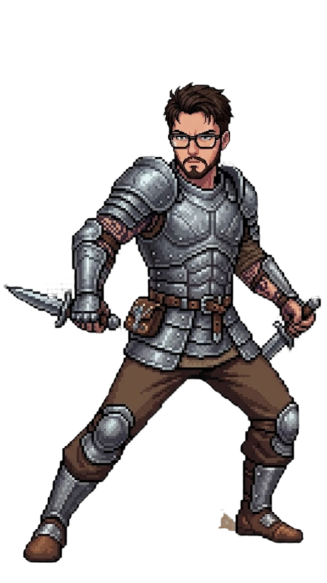

<h1 align="center">⚔️ Jackson A. Lourenço | Solo Leveling Dev System</h1>

<p align="center">
  
</p>

<p align="center">
  
  
  
</p>

---

## 🎮 Interface do Sistema

<table>
  <tr>
    <td width="33%" valign="top">

### 🧬 Status

```text
╔══════════════════════╗
║      PLAYER HUD      ║
╠══════════════════════╣
║ Nome: Jackson        ║
║ Classe: Full Stack   ║
║ Título: Em Ascensão  ║
║ Rank: C            ║
║ Cargo: Estagio     ║
╚══════════════════════╝
```

</td>
<td width="34%" align="center" valign="top">

### 🧍 Avatar



> Nível 3: evolução por boss concluído

</td>
<td width="33%" valign="top">

### 📊 Atributos

```text
ATAQUE    [████░░░░░░] 46
DEFESA    [████░░░░░░] 44
VIDA      [████░░░░░░] 48
AGILIDADE [██░░░░░░░░] 20
```
<!-- ATTRIBUTES:START -->
<!-- ATTRIBUTES:END -->

> Ataque e Defesa escalam com o nível do personagem.  
> Vida = idade x 2 (auto).  
> Agilidade = 1 ponto por mês de experiência na área (auto).

</td>
  </tr>
</table>

---

## 📈 Progressão de Nível

<p align="center">
  
  
</p>

<p align="center">
  
  
</p>

---

## 🛡️ Inventário (Cursos e Certificados)

| Slot | Item Épico | Bônus | Fonte |
|---|---|---|---|
| 🧠 Cabeça | Elmo da Lógica | +INT | Curso de Algoritmos |
| 🛡️ Peito | Armadura da Arquitetura | +END | Certificação Back-end |
| ⚔️ Mão Principal | Espada Spring Core | +STR | Curso Spring Boot |
| 🗡️ Mão Secundária | Adaga Async JS | +AGI | Curso JavaScript/Node |
| 👢 Botas | Passos Responsivos | +AGI | Curso React + CSS |
| 💍 Acessório | Anel do Banco de Dados | +INT | Curso PostgreSQL/MongoDB |

> Cada certificado novo = item novo no inventário.

---

## 👹 Raid de Bosses (Carreira)

- [X] Boss 1: Entrar no mercado de trabalho
- [X] Boss 2: Estágio
- [ ] Boss 3: Assistente
- [ ] Boss 4: Desenvolvedor Júnior
- [ ] Boss 5: Desenvolvedor Pleno
- [ ] Boss 6: Desenvolvedor Sênior
- [ ] Boss 7: Tech Lead / Engenheiro

```text
Quest Principal: Derrotar todos os Bosses e alcançar Rank SS
Recompensa Final: Construir produtos de alto impacto
```

### 🖼️ Galeria da Raid

<table>
  <tr>
    <td align="center">
      <strong>Boss 1</strong><br/>Entrar no mercado<br/>
      
    </td>
    <td align="center">
      <strong>Boss 2</strong><br/>Estágio<br/>
      
    </td>
    <td align="center">
      <strong>Boss 3</strong><br/>Assistente<br/>
      
    </td>
  </tr>
  <tr>
    <td align="center">
      <strong>Boss 4</strong><br/>Desenvolvedor Júnior<br/>
      
    </td>
    <td align="center">
      <strong>Boss 5</strong><br/>Desenvolvedor Pleno<br/>
      
    </td>
    <td align="center">
      <strong>Boss 6</strong><br/>Desenvolvedor Sênior<br/>
      
    </td>
  </tr>
  <tr>
    <td align="center" colspan="3">
      <strong>Boss 7</strong><br/>Tech Lead / Engenheiro<br/>
      
    </td>
  </tr>
</table>

---

## 💻 Arsenal Técnico


---

## 🚀 Missões em Destaque

- 🧠 [Projeto de classe bancária](https://github.com/jacksonlourenco/BankingClass)

<p align="center"><i>"Evolução não é sorte. É rotina, foco e commits."</i></p>


