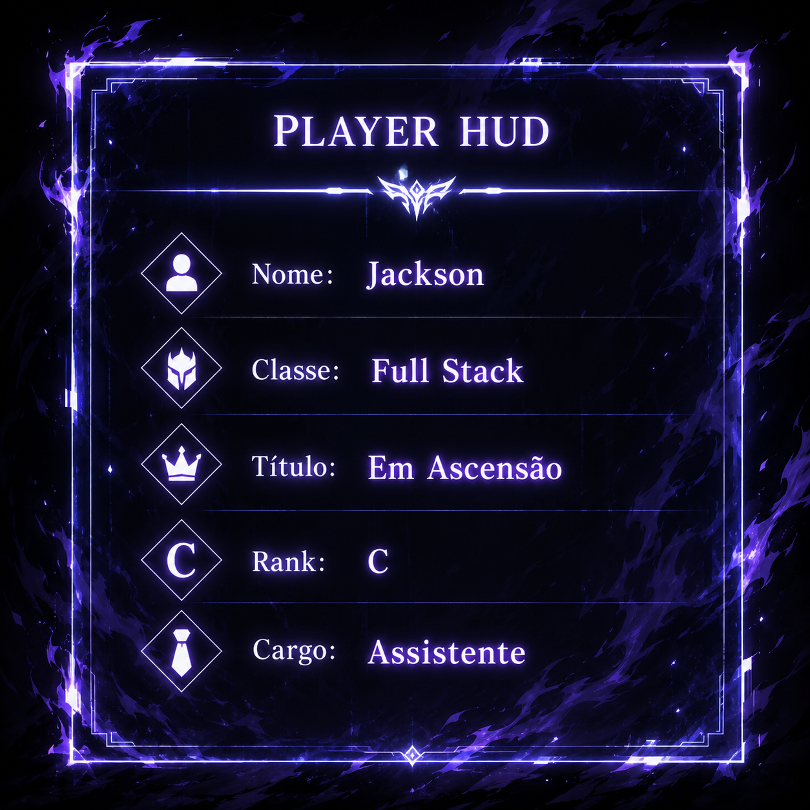
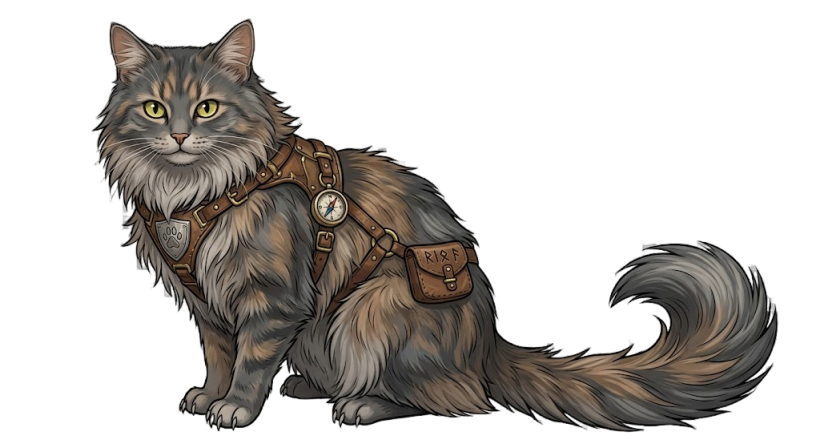
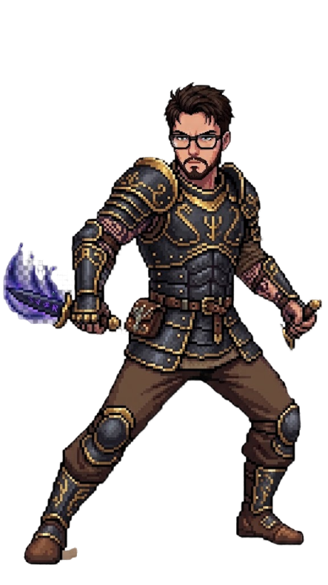
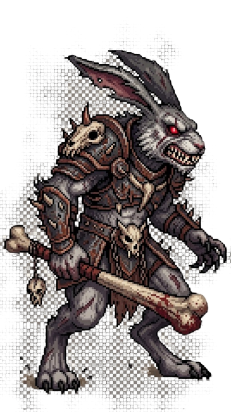
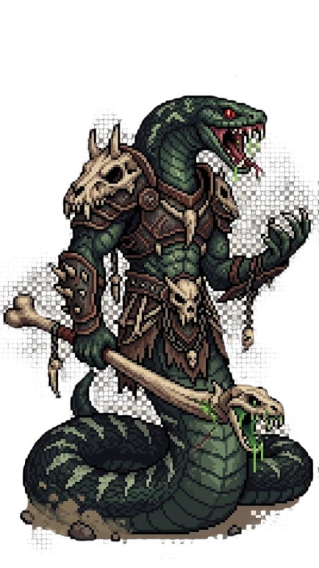
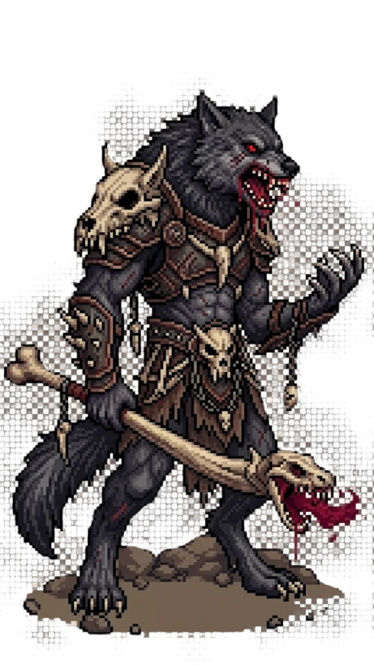
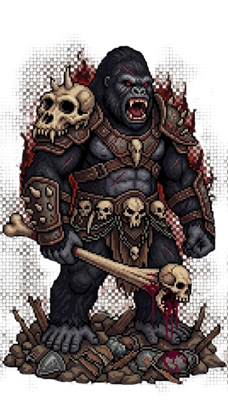
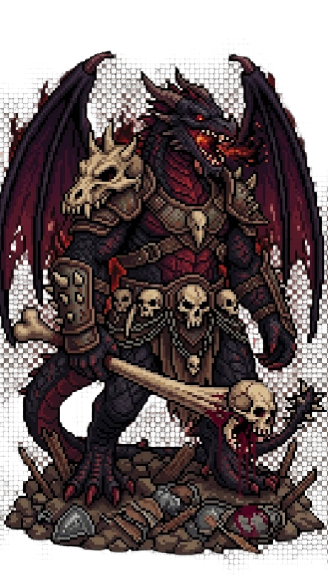
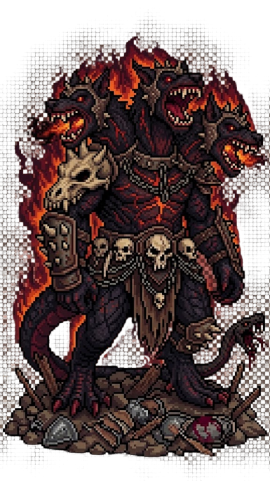
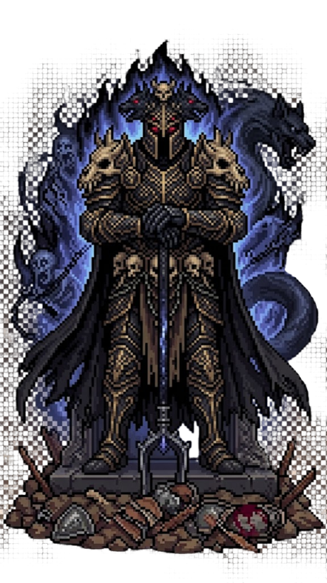

<h1 align="center">⚔️ Jackson A. Lourenço |  Leveling Dev System</h1>

---

## 🎮 Interface do Sistema

<table>
  <tr>
    <td width="33%" valign="top">

### 🧬 Status

<p align="center">
  
</p>

### 🐾 Companheiro

<p align="center">
  
</p>

</td>
<td width="34%" align="center" valign="top">

### 🧍 Avatar

 

</td>
<td width="33%" valign="top">

### 📊 Atributos

```text
ATAQUE    [█████░░░░░] 58
DEFESA    [█████░░░░░] 56
VIDA      [████░░░░░░] 48
AGILIDADE [██░░░░░░░░] 20
```
<!-- ATTRIBUTES:START -->
<!-- ATTRIBUTES:END -->

### 🧩 Missões Secundárias

| Projeto | Rank |
|---|---|
| [Classe bancária](https://github.com/jacksonlourenco/BankingClass) | D |
| [Rank Utopia](https://github.com/jacksonlourenco/Rank_UtopiaSL) | C |
| [Fórum Slayer Legend](https://github.com/jacksonlourenco/Forum_SlayerLegend) | A |
| [Pitch Entra21](https://github.com/jacksonlourenco/pitch-final-entra21-backend) | S |

</td>
  </tr>
</table>

---

## 🛡️ Inventário (Cursos e Certificados)

| Curso | Link do Certificado |
|---|---|
| Algoritmos | [Adicionar link](https://example.com) |
| Back-end | [Adicionar link](https://example.com) |
| Spring Boot | [Adicionar link](https://example.com) |
| JavaScript/Node | [Adicionar link](https://example.com) |
| React + CSS | [Adicionar link](https://example.com) |
| PostgreSQL/MongoDB | [Adicionar link](https://example.com) |

---

## 👹 Raid de Bosses (Carreira)

<!-- BOSSES:START -->
- [x] Boss 1: Entrar no mercado de trabalho - 06/2022 - DiamondBigger
- [x] Boss 2: Estágio - 06/2022 - DiamondBigger
- [x] Boss 3: Assistente - 10/2025 - Capgemini
- [ ] Boss 4: Desenvolvedor Júnior - MM/AAAA - Empresa
- [ ] Boss 5: Desenvolvedor Pleno - MM/AAAA - Empresa
- [ ] Boss 6: Desenvolvedor Sênior - MM/AAAA - Empresa
- [ ] Boss 7: Tech Lead / Engenheiro - MM/AAAA - Empresa
<!-- BOSSES:END -->

```text
Quest Principal: Derrotar todos os Bosses e alcançar Rank SS
Recompensa Final: Construir produtos de alto impacto
```

### 🖼️ Galeria da Raid

<!-- BOSS_GALLERY:START -->
<table>
  <tr>
    <td align="center">
      <br/>
      <br/>
      <br/>
      
    </td>
    <td align="center">
      <br/>
      <br/>
      <br/>
      
    </td>
    <td align="center">
      <br/>
      <br/>
      <br/>
      
    </td>
  </tr>
  <tr>
    <td align="center">
      <br/>
      <br/>
      <br/>
      
    </td>
    <td align="center">
      <br/>
      <br/>
      <br/>
      
    </td>
    <td align="center">
      <br/>
      <br/>
      <br/>
      
    </td>
  </tr>
  <tr>
    <td align="center" colspan="3">
      <br/>
      <br/>
      <br/>
      
    </td>
  </tr>
</table>
<!-- BOSS_GALLERY:END -->

---

## 💻 Arsenal Técnico


---

<p align="center"><i>"Evolução não é sorte. É rotina, foco e commits."</i></p>


